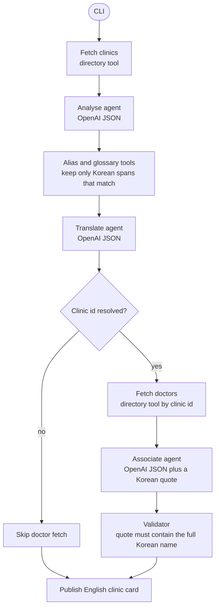

# Gangnam clinic pipeline

Three OpenAI agents sit between directory tools. The model extracts, translates, and proposes a doctor. Code publishes a doctor only when the quote contains that doctor's full Korean name.



`supported` means the Korean span matched. It does not mean a license was checked.

## Run

```bash
npm install
cp .env.example .env   # then set OPENAI_API_KEY
npm run broken
npm start
npm test
npm run typecheck
```

The default model is `gpt-4o-mini`. Override it with `OPENAI_MODEL` in `.env`. Every model response is parsed with zod before the pipeline reads it. Tests inject a scripted model so the quote gate runs without a network call. `npm start` calls OpenAI.

## Steps

1. **Fetch clinics.** The directory connector returns three Korean pages. No model.
2. **Analyse agent.** OpenAI copies procedure and doctor spans from the Korean body. The glossary drops any procedure the model named that is not actually in the text, so `리프팅` cannot become a canonical procedure.
3. **Translate agent.** OpenAI writes the English summary from the canonical clinic name and the confirmed procedures.
4. **Fetch doctors.** Runs only with a resolved clinic id. `강남뷰티의원` never gets this call.
5. **Associate agent.** OpenAI may propose one roster doctor and must return a verbatim Korean quote.
6. **Validate.** The quote has to sit inside the page and include the full Korean name. A surname quote is rejected and the English summary is rewritten without a doctor.
7. **Publish.** English clinic cards, with a doctor only when the quote passed.

## Where it broke

The first associate prompt told the model to pick the first roster doctor surnamed Kim when the page only contained `김`. It did, and the validator accepted the quote because `김` appears in `김 원장님`. Banobagi was published under Kim Tae-hyung, who is not named on that page. The translate prompt had also been told to write "Dr. Kim".

The associate prompt now requires `nameKo` in the quote, and the validator enforces the same rule. A model that still guesses is overwritten to `doctorStatus: unresolved`, and the English line is rewritten from the confirmed procedure and clinic. ID Hospital still attaches 김민준, because that name is on the page.

## Fixtures

| page | Fixed result |
| --- | --- |
| 바노바기성형외과, rhinoplasty, `김 원장님` | published clinic, doctor unresolved |
| 아이디병원, double eyelid, `김민준` | published clinic and Kim Min-jun |
| 강남뷰티의원 | quarantined, doctor agent not called |
